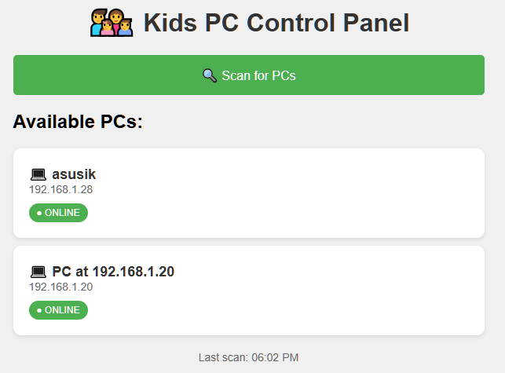

# Kid PC Monitor

DIY parental control system for parents who code. If you know what 'pip install' means, this is for you!


## 🎯 Features

- **📱 Control from your phone** - Web interface works on any device
- **🔒 Remote lock/unlock detection** - See if kids' PCs are locked
- **⏰ Scheduled bedtime locks** - Automatically lock at set times
- **⏱️ Daily usage limits** - Set maximum screen time
- **💬 Send messages** - Display warnings or reminders
- **🏠 Auto-discovery** - Finds all PCs on your network
- **⏰ Grace period warnings** - 15, 5, and 1-minute warnings before locks
- **💾 Persistent settings** - Limits survive PC restarts
- **👤 User-specific restrictions** - Monitor only specific Windows accounts
- **📊 Real-time status** - See current limits and time remaining

## 📸 Screenshots




## 🚀 Quick Start

## ⚠️ Technical Skills Required

This is NOT a one-click solution. You'll need to:
- Install Python
- Use a terminal / command prompt
- Understand IP addresses
- Open firewall ports where needed (Windows on kid PCs; on Linux parents, e.g. `ufw` or your distro's firewall)
- On kid PCs: set up a Windows scheduled task (the installer does this)

If these terms scare you, consider commercial alternatives like:
- Qustodio
- Net Nanny
- Windows Family Safety

### Prerequisites
- **Kid PCs:** Windows 10/11 (the monitoring agent uses Windows APIs)
- **Parent / admin machine:** Windows, Linux, or macOS with Python 3.7+ (runs the Flask web panel only)
- **Network:** Kid PCs must accept inbound TCP **9999** from the machine running the web panel (usually the same LAN; cross-subnet works if routed and allowed by firewalls). The web panel listens on TCP **5000** for your browser or phone.

Auto-discovery scans the `/24` subnet containing the parent machine's primary IPv4 address (see `scan_for_servers` in `src/web_panel.py`). If discovery misses a PC, you can still use it once the agent is reachable at its IP.

### Installation

There are two ways to set up Kid PC Monitor:

#### Windows agent firewall (kid PCs)

When you run `scripts/install.py` as administrator, it creates a Windows Firewall inbound rule for TCP **9999** scoped to the scheduled `pythonw.exe`. By default the rule applies only on **Private** and **Domain** networks—not **Public**—so strangers on open Wi‑Fi cannot reach the agent.

After the scheduled task is created, the installer asks whether to allow **Public** networks too. Say **yes** if you use a laptop and a child might disconnect and reconnect Wi‑Fi; Windows can then treat your home network as Public and block remote control until you fix the network profile or re-run the installer. Desktop PCs on a trusted home LAN usually keep the default (**no**). Only enable Public if you accept the extra exposure on genuinely untrusted networks.

#### Option A: Separate Parent PC (Recommended)

Run the web panel on a separate PC (your own computer). More secure since kids can't access the admin interface.

1. **On each kid's PC:**
```bash
git clone https://github.com/rookie7799/kid-pc-monitor.git
cd kid-pc-monitor
pip install -r requirements.txt

# Run installer as administrator
python scripts/install.py
```

The installer asks whether to install for **this account** (the simple path — works when the kid's account is the only one on the PC, even if it has admin rights) or for **a different user account** (cross-user install: a parent/admin runs the installer and provides the child's username; the agent then launches in the child's session at their logon).

For the cross-user mode:
- Files install to `C:\ProgramData\KidPCMonitor` and the child account is granted read+execute.
- Python must be installed **for all users** (not the per-user `%LOCALAPPDATA%\Programs\Python\…` install) so the child's task can launch `pythonw.exe`. The installer refuses with a clear message if only a per-user Python is found.
- The scheduled task runs at the child's logon only, with `LeastPrivilege` (no UAC prompt for the kid).
- The agent writes its log and state to `%LOCALAPPDATA%\KidPCMonitor` in the child's profile.

2. **On your PC (Windows or macOS; for Linux, see the Linux parent steps below):**
```bash
git clone https://github.com/rookie7799/kid-pc-monitor.git
cd kid-pc-monitor/src
pip install -r ../requirements.txt
python web_panel.py

# Open in browser: http://YOUR-PC-IP:5000
```

**Linux parent machine:** The web panel does not require `pywin32`; `requirements.txt` installs it only on Windows. From the repo root:

```bash
git clone https://github.com/rookie7799/kid-pc-monitor.git
cd kid-pc-monitor
python3 -m venv .venv
source .venv/bin/activate   # On Windows: .venv\Scripts\activate
pip install -r requirements.txt
cd src
python3 web_panel.py
```

Then open `http://YOUR-LINUX-IP:5000` from your phone or browser. Allow inbound TCP **5000** on the Linux host (example with UFW: `sudo ufw allow 5000/tcp`).

**Install as a user service (survives reboot when user lingering is enabled):** from the repo root, after `pip install -r requirements.txt`:

```bash
chmod +x scripts/install_web_panel_linux.sh
./scripts/install_web_panel_linux.sh install   # writes ~/.config/systemd/user/kid-pc-monitor-web-panel.service
./scripts/install_web_panel_linux.sh status
# ./scripts/install_web_panel_linux.sh uninstall   # when you want it gone
```

Use `./scripts/install_web_panel_linux.sh cat-unit` to preview the unit. Override the interpreter with `PYTHON=/path/to/python3 ./scripts/install_web_panel_linux.sh install` if you do not use a repo-root `.venv`. For the service to start at boot **before anyone logs in graphically**, run once: `sudo loginctl enable-linger "$USER"`.

#### Option B: Single PC Setup

Run everything on the kid's PC and access the admin panel from your phone. Convenient if you don't have a separate PC always running.

1. **On the kid's PC (as administrator):**
```bash
git clone https://github.com/rookie7799/kid-pc-monitor.git
cd kid-pc-monitor
pip install -r requirements.txt

# Install both services
python scripts/install.py           # Installs pc_control
python scripts/install_web_panel.py # Installs web panel
```

2. **On your phone:**
   - Open browser and go to `http://KIDS-PC-IP:5000`
   - Bookmark it for easy access

Both services run invisibly in the background using `pythonw.exe`.

**Note:** With this setup, a tech-savvy child could potentially discover the web panel at `localhost:5000`. Option A is more secure.

---

*Side note: if your kid is "good" with computers, consider copying the scripts somewhere less obvious.*

## 🖥️ Command-line client

From the repo, run the CLI on your parent machine (Linux, macOS, or Windows):

```bash
cd kid-pc-monitor/src
python3 pc_cli.py scan
python3 pc_cli.py inspect 192.168.1.105
python3 pc_cli.py set-limit 192.168.1.105 60
python3 pc_cli.py add-lock-time 192.168.1.105 21:00
python3 pc_cli.py lock 192.168.1.105
```

Use `python3 pc_cli.py --help` for all commands (`message`, `shutdown`, `extend-time`, `clear-all`, `raw`, etc.). Add `--json` for scripting. Scan a specific subnet with `pc_cli.py scan --subnet 192.168.1.0/24`.

## 📖 Usage Guide

### Setting Up Daily Limits
1. Open the web interface on your phone
2. Click on a PC
3. View current settings in the "📊 Current Settings" section
4. Use quick buttons: "30 min", "1 hour", "2 hours"
5. Or set a custom time limit
6. Page auto-refreshes to show the new limit

### Setting Bedtime
1. Select a PC
2. Scroll to "Set Lock Time"
3. Choose bedtime (e.g., 9:00 PM)
4. PC will lock automatically at that time and stay locked for the rest of the day — if the child signs back in after the bedtime minute, the agent re-locks immediately. The window resets at local midnight.
5. See the scheduled lock in "Current Settings"

Note: when a usage limit, bedtime, or manual lock is active, the agent re-issues the lock whenever it detects the screen has been unlocked, so the child can't bypass it by typing their Windows password. The **Lock Computer Now** button enables a manual lock that remains active until you clear all limits.

### Clearing/Removing Limits
1. View the "📊 Current Settings" section
2. Click the **❌ Clear** button next to any limit you want to remove
3. Or click **🗑️ Clear All Limits** to remove everything
4. Changes take effect immediately

### Emergency Unlock
While remote unlock isn't possible for security, you can:
- Clear the usage limit to grant unlimited time
- Clear scheduled locks to prevent automatic locking
- Clear all limits to release a manual **Lock Computer Now** lock
- Send a message to request unlock
- Restart the PC (if no password)

## ⚙️ Configuration

### Custom PC Names
Edit `CUSTOM_PC_NAMES` in `src/remote_client.py` (used by the web panel and `pc_cli.py`):
```python
CUSTOM_PC_NAMES = {
    '192.168.1.105': 'Tommy\'s Laptop',
    '192.168.1.112': 'Sarah\'s Desktop',
}
```

### User-Specific Monitoring
Monitor only specific Windows user accounts. Edit `src/pc_control.py`:

```python
# Option 1: Monitor ONLY these specific users
MONITORED_USERS = ['Tommy', 'Sarah']  # Only these kids are restricted
EXEMPT_USERS = []

# Option 2: Monitor everyone EXCEPT these users
MONITORED_USERS = []
EXEMPT_USERS = ['pavel', 'Mom', 'Dad']  # Parents are exempt

# Option 3: Monitor ALL users (default)
MONITORED_USERS = []
EXEMPT_USERS = []
```

**Use Case:** If multiple family members share one PC, you can restrict only the children's accounts while leaving parent accounts unrestricted.

### Persistent State
Settings are automatically saved to `pc_control_state.json` including:
- Daily usage limits
- Scheduled lock times
- Start time for usage tracking

This means restrictions **survive PC restarts** - kids can't bypass by rebooting!


## 🔧 Troubleshooting

### "PC shows as Unknown"
- Add custom names in configuration
- Check Windows Firewall settings
- Ensure PCs are on same network

### "Can't connect from phone"
- Check firewall allows port 5000 (web panel host) and port 9999 (each kid PC running the agent)
- On Linux parents, ensure the host firewall allows inbound **5000/tcp** (e.g. `ufw allow 5000/tcp`)
- Use the web panel machine's IP address, not localhost
- Ensure `web_panel.py` is running

### "Lock status not updating"
- Restart pc_control.py
- Check if LogonUI.exe detection works
- See logs in console window

## 🛡️ Security Notes

- Only works on local network (not internet)
- Optional **parent web panel** password: use **Add password protection** on the home page. Only a secure hash is stored in `web_panel_auth.json` next to the app (not the plain password). Until you set one, anyone on the LAN can use the panel—the same as before this feature.
- Can't bypass Windows lock screen
- Kids can close the agent if their account has admin rights. If you install in cross-user mode (admin installs, non-admin child runs), the child cannot stop or delete the scheduled task or its files.

## 🤝 Contributing

Parents and developers welcome! Please:
1. Fork the repository
2. Create a feature branch
3. Submit a pull request

### Recent Improvements (v2.0)
- ✅ Grace period warnings (15, 5, 1 minute before lock)
- ✅ Persistent state storage (settings survive restarts)
- ✅ User-specific restrictions (monitor only certain accounts)
- ✅ Fixed usage time calculation bug
- ✅ Improved error handling and logging
- ✅ Web UI shows current limits and time remaining
- ✅ Better resource management

### Ideas for Future Contributions
- Linux/macOS **agent** (kid-side monitoring; the web panel already runs on Linux/macOS/Windows)
- Mobile app
- Usage statistics/reports
- Reward system integration
- Application-specific time limits
- Authentication/password protection

## 📄 License

MIT License - feel free to modify for your family's needs!

## ❤️ Acknowledgments

Created by parents, for parents. Special thanks to all contributors who help make screen time management easier!

---

**Need Help?** Open an [issue](https://github.com/rookie7799/kid-pc-monitor/issues) or check our [FAQ](docs/FAQ.md)
